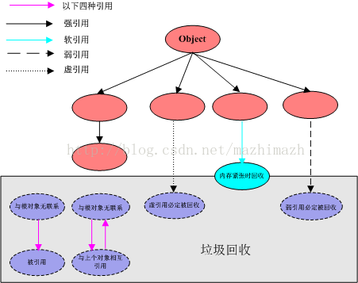
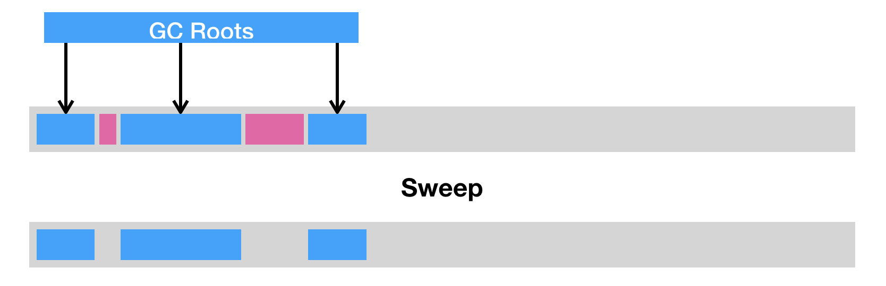
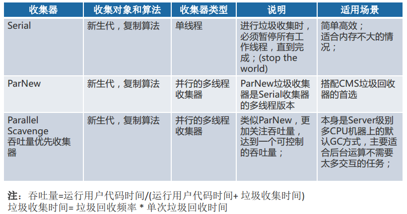
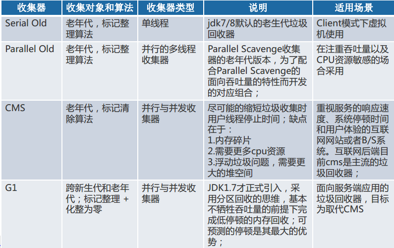

# java垃圾回收

[[toc]]
## java4种引用类型

&emsp;&emsp;java4种引用的级别由高到低依次为：强引用 > 软引用 > 弱引用 > 虚引用，具体如下：

### 强引用
&emsp;&emsp;把一个对象赋给一个引用变量，这个引用变量就是一个强引用。当一个对象被强引用变量引用时，它处于可达状态，
它是不可能被垃圾回收机制回收的，即使该对象以后永远都不会被用到JVM也不会回收。不使用时，可以采用如下方式弱化引用：

```java
Object o = new Object();   //  强引用
o = null;     // 帮助垃圾收集器回收此对象
```

### 软引用

&emsp;&emsp;引用需要用 SoftReference 类来实现，对于只有软引用的对象来说，当系统内存足够时它
不会被回收，当系统内存空间不足时它会被回收。软引用通常用在对内存敏感的高速缓存。具体使用如下：

```java
String str = new String("abc");                                     // 强引用
SoftReference<String> softRef = new SoftReference<String>(str);     //

//gc 时候处理方式
If(JVM.内存不足()) {
   str = null;  // 转换为软引用
   System.gc(); // 垃圾回收器进行回收
}
```

### 弱引用

&emsp;&emsp;弱引用需要用`WeakReference`类来实现，它比软引用的生存期更短，对于只有弱引用的对象来说，
只要垃圾回收机制一运行，不管JVM的内存空间是否足够，总会回收该对象占用的内存。具体使用如下：
```java
String str=new String("abc");
WeakReference<String> abcWeakRef = new WeakReference<String>(str);
str=null;

//等价于
str = null;
System.gc();
```

### 虚引用

&emsp;&emsp;虚引用需要`PhantomReference`类来实现，它不能单独使用，必须和引用队列联合使用。虚引用的主要作用是跟踪对象被垃圾回收的状态。
当垃圾回收器准备回收一个对象时，如果发现它还有虚引用，就会在回收对象的内存之前，把这个虚引用加入到与之关联的引用队列中。

### 垃圾回收策略

&emsp;&emsp;4种引用垃圾回收策略，具体见下图：


&emsp;&emsp;根据上图整理成下面图表结构：
引用类型 | 被垃圾回收时间 | 用途 |	生存时间
---|---|---|---
强引用 | 从来不会| 对象的一般状态| JVM停止运行时终止
软引用 | 在内存不足时| 对象缓存| 内存不足时终止
弱引用 | 在垃圾回收时| 对象缓存| gc运行后终止
虚引用 | Unknown| Unknown| Unknown

## 垃圾判定

&emsp;&emsp;垃圾回收(Garbage Collection)是java虚拟机垃圾回收器提供的一种用于在空闲时间不定时回收无任何对象引用的对象占据的内存空间的一种机制。

### 引用计数法

**实现原理**：为每个对象添加一个引用计数器，用来统计指向该对象的引用个数。一旦某个对象的引用计数器为0，则说明该对象已经死亡，便可以被回收。

**实现过程**：如果有一个引用，被赋值为某一对象，那么将该对象的引用计数器+1。如果一个指向某一对象的引用，被赋值为其他值，那么将该对象的引用计数器-1。
也就是说，我们需要截获所有的引用更新操作，并且相应地增减目标对象的引用计数器。

**缺点**：1、需要额外的空间来存储计数器，以及繁琐的更新操作；2、引用计数法还有一个重大的漏洞，那便是无法处理循环引用对象。

:::tip
   循环引用会导致内存泄漏
:::

### 可达性分析

**实现原理**：在于将一系列`GC Roots`作为初始的存活对象合集（`live set`），然后从该合集出发，探索所有能够被该集合引用到的对象，
并将其加入到该集合中，这个过程我们也称之为标记（`mark`）。最终，未被探索到的对象便是死亡的，是可以回收的。

:::tip
&emsp;&emsp;我们可以暂时理解为**由堆外指向堆内的引用**，一般而言，`GC Roots`包括如下几种：<br>
- java 方法栈桢中的局部变量；
- 已加载类的静态变量；
- JNI handles；
- 已启动且未停止的java线程。
:::

**优点**：可达性分析可以解决引用计数法所不能解决的循环引用问题。举例来说，即便对象a和b相互引用，只要从`GC Roots`出发无法到达a或者b，
那么可达性分析便不会将它们加入存活对象合集之中。

**存在问题**：在多线程环境下，其他线程可能会更新已经访问过的对象中的引用，从而造成误报（将引用设置为 null）或者漏报（将引用设置为未被访问过的对象）。

:::warning
&emsp;&emsp;误报并没有什么伤害，Java 虚拟机至多损失了部分垃圾回收的机会。漏报则比较麻烦，因为垃圾回收器可能回收事实上仍被引用的对象内存。
一旦从原引用访问已经被回收了的对象，则很有可能会直接导致 Java 虚拟机崩溃。
:::

### stop-the-world以及安全点
**概念**：Stop-the-world，停止其他非垃圾回收线程的工作，直到完成垃圾回收。这也就造成了垃圾回收所谓的暂停时间（GC pause）。

**实现原理**：java虚拟机中的 Stop-the-world是通过安全点（`safepoint`）机制来实现的。当java虚拟机收到stop-the-world请求，
它便会等待所有的线程都到达安全点，才允许请求Stop-the-world的线程进行独占的工作。

**安全点实现原理**:安全点不是让其他线程停下，而是找到一个稳定的执行状态。在这个执行状态下，java虚拟机的堆栈不会发生变化。
这么一来，垃圾回收器便能够“安全”地执行可达性分析。如何判定程序处在安全点，有以下方式：
- 使用JNI执行本地代码不访问java对象、调用java方法或者返回至原java方法，
- 线程处于阻塞状态为安全点，处于其他状态时，需要虚拟机保证在可预见的时间内进入安全点
- 解释执行字节码时，字节码与字节码之间皆可做安全点，jvm虚拟机会对执行的每条字节码进行安全点检测
- 执行及时编译器生成的字节码时，需要虚拟机插入安全点检测，避免长时间没有安全点检测
:::tip
第一，安全点检测本身也有一定的开销。不过 HotSpot 虚拟机已经将机器码中安全点检测简化为一个内存访问操作。
在有安全点请求的情况下，java虚拟机会将安全点检测访问的内存所在的页设置为不可读，并且定义一个`segfault`处理器，来截获因访问该不可读内存而触发`segfault`线程，并将它们挂起。

第二，即时编译器生成的机器码打乱了原本栈桢上的对象分布状况。在进入安全点时，机器码还需提供一些额外的信息，来表明哪些寄存器，
或者当前栈帧上的哪些内存空间存放着指向对象的引用，以便垃圾回收器能够枚举`GC Roots`。
:::

## 垃圾回收方法

&emsp;&emsp;当标记完所有的存活对象时，我们便可以进行死亡对象的回收工作了。主流的基础回收方式可分为三种。

### 清除（sweep）

&emsp;&emsp;把死亡对象所占据的内存标记为空闲内存，并记录在一个空闲列表（`free list`）之中。
当需要新建对象时，内存管理模块便会从该空闲列表中寻找空闲内存，并划分给新建的对象。具体见下图：


**缺点**：一是会造成内存碎片。由于java虚拟机的堆中对象必须是连续分布的，因此可能出现总空闲内存足够，但是无法分配的极端情况。<br>
另一个则是分配效率较低。如果是一块连续的内存空间，那么我们可以通过指针加法（`pointer bumping`）来做分配。而对于空闲列表，
java虚拟机则需要逐个访问列表中的项，来查找能够放入新建对象的空闲内存。

### 压缩（compact）

&emsp;&emsp;即把存活的对象聚集到内存区域的起始位置，从而留下一段连续的内存空间。这种做法能够解决内存碎片化的问题，
但代价是压缩算法的性能开销。具体见下图：


### 复制（copy）

&emsp;&emsp;即把内存区域分为两等分，分别用两个指针from和to来维护，并且只是用from指针指向的内存区域来分配内存。
当发生垃圾回收时，便把存活的对象复制到to指针指向的内存区域中，并且交换from指针和to指针的内容。
复制这种回收方式同样能够解决内存碎片化的问题，但是它的缺点也极其明显，即堆空间的使用效率极其低下。具体见下图：


### 垃圾回收分代思想
&emsp;&emsp;java虚拟机将堆划分为新生代和老年代。其中，新生代又被划分为`Eden`区，以及两个大小相同的`Survivor`区。具体见下图：


&emsp;&emsp;默认情况下，java虚拟机采取的是一种动态分配的策略（对应java虚拟机参数`-XX:+UsePSAdaptiveSurvivorSizePolicy`），
根据生成对象的速率，以及`Survivor`区的使用情况动态调整`Eden`区和`Survivor`区的比例。

&emsp;&emsp;当我们调用`new`指令时，它会在`Eden`区中划出一块作为存储对象的内存。由于堆空间是线程共享的，因此直接在这里边划空间是需要进行同步的。
java虚拟机采用预先分配的方式，其每个线程可以向java虚拟机申请一段连续的内存，比如2048字节，作为线程私有的TLAB。
这个操作需要加锁，线程需要维护两个指针（实际上可能更多，但重要也就两个），一个指向TLAB中空余内存的起始位置，一个则指向TLAB末尾。

&emsp;&emsp;接下来的`new`指令，便可以直接通过指针加法（`bump the pointer`）来实现，即把指向空余内存位置的指针加上所请求的字节数。
如果加法后空余内存指针的值仍小于或等于指向末尾的指针，则代表分配成功。否则，TLAB已经没有足够的空间来满足本次新建操作，
则便需要当前线程重新申请新的TLAB。

&emsp;&emsp;当`Eden`区的空间耗尽时，java虚拟机便会触发一次`Minor GC`，来收集新生代的垃圾。
当发生`Minor GC`时，`Eden`区和`from`指向的`Survivor`区中的存活对象会被复制到`to`指向的`Survivor`区中，然后交换`from`和`to`指针，
以保证下一次`Minor GC`时，`to`指向的`Survivor`区还是空的,同时java虚拟机会记录`Survivor`区中的对象被复制次数。

:::tip
- 如果一个对象被复制的次数为15对应虚拟机参数`-XX:+MaxTenuringThreshold`），那么该对象将被晋升至老年代。<br>
- 如果单个`Survivor`区已经被占用了50%（对应虚拟机参数`-XX:TargetSurvivorRatio`），
那么较高复制次数的对象也会被晋升至老年代。
:::

**优点**：年轻代使用标记-复制算法，由于需要复制的数据将非常少，因此效果较好，而且也不用对整个堆栈进行扫描。<br>
**存在的问题**：老年代的对象引用年轻代中的对象，采用**卡带**来解决全堆扫描问题。

### 卡表

**设计思想**：该技术将整个堆划分为一个个大小为512字节的卡，并且维护一个卡表，用来存储每张卡的一个标识位。
这个标识位代表对应的卡是否可能存有指向新生代对象的引用，存在即为脏卡。在进行`Minor GC`的时候，我们便可以不用扫描整个老年代，
而是在卡表中寻找脏卡，并将脏卡中的对象加入到`Minor GC`的`GC Roots`里。当完成所有脏卡的扫描之后，java虚拟机便会将所有脏卡的标识位清零。

**实现过程**：`Minor GC`复制存活对象时，导致所有指向该对象的引用更新，最终引用所在的卡的标识位重新设置，
这样可以确保脏卡中必定包含指向新生代对象的引用。具体实现时，java虚拟机需要截获每个引用型实例变量的写操作，
并作出对应的写标识位操作。

**存在问题**：在即时编译器生成的机器码中，需要使用写屏障（`write barrier`，注意不要和`volatile`字段的写屏障混淆）实现脏卡识别。
写屏障并不会判断更新后的引用是否指向新生代中的对象，采用悲观的方式，一律当成可能指向新生代对象的引用。
java虚拟机便是通过这种方式来从地址映射到卡表中的索引的。缺点：新增开销，优点：提升吞吐率（应用运行时间/(应用运行时间+垃圾回收时间)。
具体如下：

```java
//会被编译成移位指令和存储指令
CARD_TABLE [this address >> 9] = DIRTY; //右移9位相当于除以512，
```

## 垃圾回收器

### 新生代回收器



### 老年代回收器



### G1回收器

**并行与并发**：G1能充分利用多CPU、多核环境下的硬件优势，缩短Stop-The-World停顿的时间，使用并发的方式减少停顿时间。

**分代收集**：使用分代的方式，采用不同的方式去处理新创建的对象和已经存活了一段时间、熬过多次GC的旧对象以获取更好的收集效果。

**空间整合**：采用“标记—整理”算法，不会产生内存空间碎片，收集后能提供规整的可用内存。

**内存布局**：整个Java堆划分为多个大小相等的独立区域（`Region`），虽然还保留有新生代和老年代的概念，均是一部分Region（不需要连续）的集合。

### java11垃圾回收器

## 垃圾回收的触发时机

- Minor GC触发条件：当Eden区满时，触发Minor GC。
- Full GC触发条件：
   - 调用System.gc时，系统建议执行Full GC，但是不必然执行
   - 老年代空间不足
   - 方法去空间不足
   - 通过Minor GC后进入老年代的平均大小大于老年代的可用内存
   - 由Eden区、From Space区向To Space区复制时，对象大小大于To Space可用内存，则把该对象转存到老年代，且老年代的可用内存小于该对象大小


