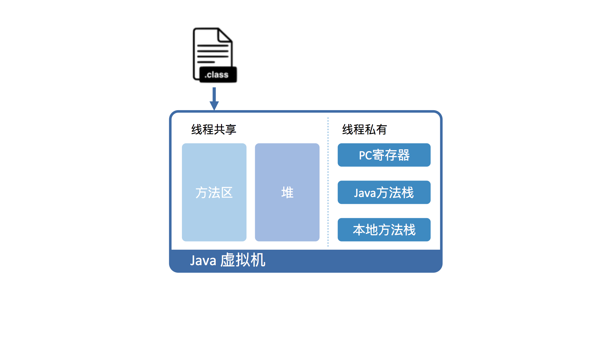

# java运行原理

[[toc]]

## 字节码生成工具AsmTools

### 简介AsmTools
&emsp;&emsp;工欲善其事必先利其器，首先来介绍AsmTools：OpenJDK提供一个AsmTools工具，用来生成正确的或者不正确的java`.class`文件，主要用来测试和验证。
AsmTools引入了两种表示.class文件的语法：

- JASM
::: tip
用类似java本身的语法来定义类和函数，字节码指令则很像传统的汇编。
:::
- JCOD
::: tip
整个.class用容器的方式来表示，可以很清楚表示类文件的结构。
:::

### 构建AsmTools

- clone 代码

```
git clone http://hg.openjdk.java.net/code-tools/asmtools
wget http://hg.openjdk.java.net/code-tools/asmtools
```

- 编绎

```
cd asmtools/build
ant
```

### 使用
```java
$ echo '
public class Foo {
 public static void main(String[] args) {
  boolean flag = true;
  if (flag) System.out.println("Hello, Java!");
  if (flag == true) System.out.println("Hello, JVM!");
 }
}' > Foo.java
$ javac Foo.java
$ java Foo
$ java -cp /path/to/asmtools.jar org.openjdk.asmtools.jdis.Main Foo.class > Foo.jasm.1
$ awk 'NR==1,/iconst_1/{sub(/iconst_1/, "iconst_2")} 1' Foo.jasm.1 > Foo.jasm
$ java -cp /path/to/asmtools.jar org.openjdk.asmtools.jasm.Main Foo.jasm
$ java Foo

```

:::tip
  jvm会把`boolean`型当做`int`来处理
:::
## java运行环境

&emsp;&emsp;RE是java运行环境，其包含Java程序的必须组件(Java虚拟机以及Java核心类库),JDK是java开发工具包，其也包含了JRE，同时还提供一系列开发、诊断工具。
JRE和JDK的JRE环境是一定差异地，有时间去研究。

## JVM的必要性

- java语言的复杂性
::: tip
  java作为一门高级程序语言，它的语法复杂，抽象程度也很高。因此在硬件上运行Java代码并不现实，所以运行Java程序之前，需要进行转换。
:::
- java的跨平台特性
::: tip
   设计一个面向Java语言特性的虚拟机，并通过编译器将Java程序转换层该虚拟机所能识别的指令序列(Java字节码),其中操作码被固定成一个字节。
   对于java代码而言，屏蔽机器的差异性，可以跨平台使用。
:::
- 提供托管环境
::: tip
   提供自动内存管理、垃圾回收机制，数组越界，动态类型、安全权限等等的动态监测，使java程序员专注于业务逻辑功能的实现。
:::

## 运行过程

### 虚拟机角度

&emsp;&emsp;执行过程：编译class文件->加载到虚拟机的方法区->虚拟机执行方法区代码，下面是具体加载流程图：

&emsp;&emsp; 其中，栈可以细分为java方法栈和本地方法栈。运行过程中，java虚拟机会在当前线程的java方法栈生成栈帧，用于存储局部变量和字节码的操作数，栈帧大小提前计算，
   在内存空间上可以不连续。<br>
&emsp;&emsp;退出当前方法执行时，正常返回或者异常返回，java虚拟机都会弹出当前线程的当前栈帧，并丢弃。

### 硬件角度

&emsp;&emsp;从硬件角度上看，java字节码无法直接执行，java虚拟机把字节码翻译成机器码。翻译过程分为两种：<br>
&emsp;&emsp;解释执行：即逐条将字节码翻译成机器码并执行；<br>
&emsp;&emsp;及时编译：(`Just-In-Time compilation`, `JIT`), 将一个方法中包含的所有字节码编译成机器码后再执行。具体见下图：

&emsp;&emsp;其中，解释执行无需等待编译，及时编译在于实际运行速度较快。一般情况下，及时编译比较耗时，需要提前编译完毕保存到内存中。`HotSpot`默认采用混合模式，综合了解释执行和即时编译两者的优点。
它会首先解释字节码。然后将其中反复执行的热点代码，以方法为单位即时编译。

## 效率提升

&emsp;&emsp;即时编译建立在程序符合二八定律的假设上。 二八定律：20%的代码占用了程序执行过程中80%的资源。对于热点代码，将其编译成机器码，此时即时编译拥有程序运行时信息，
可以根据此进行相应优化。<br>
&emsp;&emsp;HotSpot内置了多个即时编译器：`C1`、`C2`和`Graal`。具体如下：<br>
&emsp;&emsp;C1：又称`Client`编译器，面向的是对启动性能有要求的客户端GUI程序，采用的优化手段相对简单，因此编译时间较短。<br>
&emsp;&emsp;C2：`Server`编译器，面向的是对峰值性能有要求的服务端程序，采用的优化手段相对复杂，因此编译时间较长，但同时生成代码的执行效率较高。<br>
&emsp;&emsp;从Java 7开始，`HotSpot`默认采用分层编译的方式：热点方法首先被C1编译，而后热点方法中的热点会进一步被`C2`编译。
为了不干扰应用的正常运行，`HotSpot`的即时编译是放在额外的编译线程中进行。`HotSpot`会根据CPU的数量设置编译线程的数目，并且按1:2的比例配置给`C1`及`C2`编译器。
&emsp;&emsp;JVM会统计每个方法被调用了多少次，超过多少次，那就是热点方法。(还有个循环回边计数器，用来编译热循环的。)默认的分层编译应该是达到两千调C1，达到一万五调C2。


