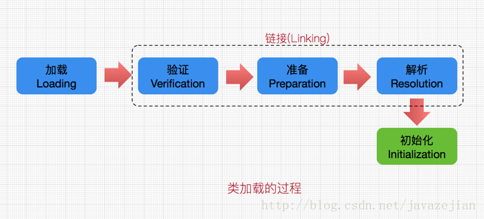

# jvm 加载原理

[[toc]]

## 加载过程

&emsp;&emsp;class文件加载到内存的类，需要经过加载、链接以及初始化三大步骤。<br>
&emsp;&emsp;java类型分为基本类型和引用类型，基本类型是由java虚拟机预定义。引用类型可以细分为：类、接口、数组和泛型参数。
泛型参数需要在编译期间被擦除，数组类会被java虚拟机直接生成。只有接口和类是java编译器生成class文件。具体加载过程如下：


## 加载

### 加载过程

- 通过一个类的全限定名来获取定义此类的二进制字节流。
- 将这个字节流所代表的静态存储结构转化为方法区的运行时数据结构。
- 在Java堆中生成一个代表这个类的java.lang.Class对象，作为方法区这些数据的访问入口。

### JVM类加载器

   &emsp;&emsp;类加载器（classloader）用来加载Java类到Java虚拟机中。一般来说，Java虚拟机使用Java类的方式如下：Java源程序（`.java` 文件）
   在经过`java`编译器编译之后就被转换成 Java 字节代码（.class 文件）。
   类加载器负责读取`java`字节代码，并转换成`java.lang.Class`类的一个实例。

- **启动（`Bootstrap`）类加载器**: 本地代码实现的类装入器，负责将<`Java_Runtime_Home>/lib`下面的类库加载到内存（比如`rt.jar`）。
                                由于引导类加载器涉及到虚拟机本地实现细节，开发者无法直接获取到启动类加载器的引用，所以不允许直接通过引用进行操作。
- **标准扩展（`Extension`）类加载器**: 由`ExtClassLoader`(`sun.misc.Launcher$ExtClassLoader`）实现,
                                   负责将`<Java_Runtime_Home>/lib/ext`或者由系统变量`java.ext.dir`指定位置中的类库加载到内存。
                                   开发者可以直接使用标准扩展类加载器。
- **系统（System）类加载器**：由`AppClassLoader`（`sun.misc.Launcher$AppClassLoader`）实现,
                          负责将系统类路径（`classpath`、`-cp/-classpath`）中指定的类库加载到内存中。开发者可以直接使用系统类加载器。

### 双亲委派机制

- 机制原理

&emsp;&emsp;某个特定的类加载器在接到加载类的请求时，首先将加载任务委托给父类加载器，依次递归，
如果父类加载器可以完成类加载任务，就成功返回；只有父类加载器无法完成此加载任务时，才自己去加载。

:::tip
   系统（`System`）类加载器 ->标准扩展（`Extension`）类加载器->启动（`Bootstrap`）类加载器 **依次递归**
:::

- SPI打破双亲委派机制 线程上下文类加载器

&emsp;&emsp;SPI的接口由java核心库来提供，依赖jar包存放在<`Java_Runtime_Home>/lib`中，由启动类加载器(`BootstrapClassloader`)来加载。
而SPI的实现类是由系统类加载器(`System ClassLoader`)来加载的。根据依照双亲委派模型，`BootstrapClassloader`无法委派`AppClassLoader`来加载类。<br>

&emsp;&emsp;线程上下文类加载器（`contextClassLoader`）是从JDK1.2开始引入。`java.lang.Thread`类中的方法`getContextClassLoader()`和`
setContextClassLoader(ClassLoader cl)`用来获取和设置线程的上下文类加载器。如果没有通过`setContextClassLoader(ClassLoader cl)`进行设置的话，
线程将继承其父线程的上下文类加载器。在线程中运行的代码可以通过此类加载器来加载类和资源。在SPI接口的代码中使用线程上下文类加载器，就可以成功的加载到SPI实现类。

## 链接

&emsp;&emsp;链接，是指将创建成的类合并至java虚拟机中，使之能够执行的过程。它可分为**验证**、**准备**以及**解析**三个阶段。

### 验证

&emsp;&emsp;验证阶段确保被加载类能够满足java虚拟机的约束条件，具体检查一下内容：
- 1.文件格式验证：
  - 是否以魔数`0xCAFEBABE`开头
  - 主、次版本号是否在当前虚拟机处理范围之内
  - 常量池的常量中是否有不被支持的常量类型（检查常量**tag标志**）
  - 指向常量的各种索引值中是否有指向不存在的常量或不符合类型的常量
  - `CONSTANT_Utf8_info`型的常量中是否有不符合`UTF8`编码的数据
  - Class文件中各个部分及文件本身是否有被删除的或附加的其他信息
- 2.元数据验证：
  - 这个类是否有父类（除了`java.lang.Object`之外，所有类都应当有父类）。
  - 这个类是否继承了不允许被继承的类（被`final`修饰的类）。
  - 如果这个类不是抽象类，是否实现了其父类或接口之中所要求实现的所有方法。
  - 类中的字段、方法是否与父类产生矛盾（例如覆盖了父类的`final`字段，或者出现不符合规则的方法重载，例如方法参数都一致，但返回值类型却不同等等）。
- 3.字节码验证：
  ::: tip
  主要目的是通过数据流和控制流分析，确定程序语义是合法的、符合逻辑的。这个阶段将对类的方法体进行校验分析，保证被校验类的方法在运行时不会产生危害虚拟机安全的事件，
  :::
   - 保证任意时刻操作数栈的数据类型与指令代码序列都能配合工作，例如不会出现类似这样的情况：在操作数栈放置了一个int类型的数据，使用时却按long类型来加载入本地变量表中。
   - 保证跳转指令不会跳转到方法体以外的字节码指令上。
   - 保证方法体中的类型转换是有效的，例如可以把一个子类对象赋值给父类数据类型，但是把父类对象赋值给子类数据类型，甚至把对象赋值给与它毫无继承关系、完全不相干的一个数据类型，则是危险不合法的。
   ::: warning
   通过程序去校验程序逻辑是无法做到绝对准确的——不能通过程序准确的检查出程序是否能在有限时间之内结束运行
   :::
- 4.符号引用验证：
  :::tip
  符号引用验证可以看作是类对自身以外（常量池中的各种符号引用）的信息进行匹配性校验
  :::
   - 符号引用中通过字符串描述的全限定名是否能够找到对应的类。
   - 在指定类中是否存在符合方法的字段描述符以及简单名称所描述的方法和字段。
   - 符号引用中的类、字段、方法的访问性（`private`、`protected`、`public`、`default`）是否可被当前类访问。

### 准备

&emsp;&emsp;为被加载类的静态字段分配内存。同时被`static`和`final`修饰的变量(基本类型和`String`)拥有`ConstantValue`属性，编译时`javac`将为该变量生成`ConstantValue`属性，
准备阶段会根据`ConstantValue`属性设置相应的值，其他则在类构造器中初始化。

### 解析

&emsp;&emsp;编译阶段java虚拟机会将自己的类以及其他类方法、字段对应的地址生成符号引用，在解析阶段java虚拟机会将这些符号引用解析成具体实际引用。
如果符号引用指定一个未被加载的类，或者未被加载的字段或者方法，那么解析将触发这个类的加载(但未必触发这个类的链接以及初始化)。


### 初始化

&emsp;&emsp;直接赋值操作和所有静态代码块中的代码，会被java编译至于同一方法`<clint>`中。初始化操作则是为标记为常量值的字段赋值，以及执行`<clint>`方法的过程。
类的初始化触发时机：
- 当虚拟机启动时，初始化用户指定的主类
- 当遇到用以新建目标类实例的new指令时，初始化new指令的目标类
- 当遇到调用静态方法的指令时，初始化该静态方法所在的类
- 当遇到访问静态字段的指令时，初始化该静态字段所在的类
- 子类的初始化会触发父类的初始化
- 如果一个接口定义了`default`方法，那么直接实现或者间接实现该接口的类的初始化，会触发该接口的初始化；
- 使用反射API对某个类进行反射调用时，初始化这个类
- 当初次调用`MethodHandle`实例时，初始化该`MethodHandle`指向方法所在的类

附录单例延迟初始化的经典代码：
```java
public class Singleton {
  private Singleton() {}
  private static class LazyHolder {
    static final Singleton INSTANCE = new Singleton();
  }
  public static Singleton getInstance() {
    return LazyHolder.INSTANCE;
  }
}
```


