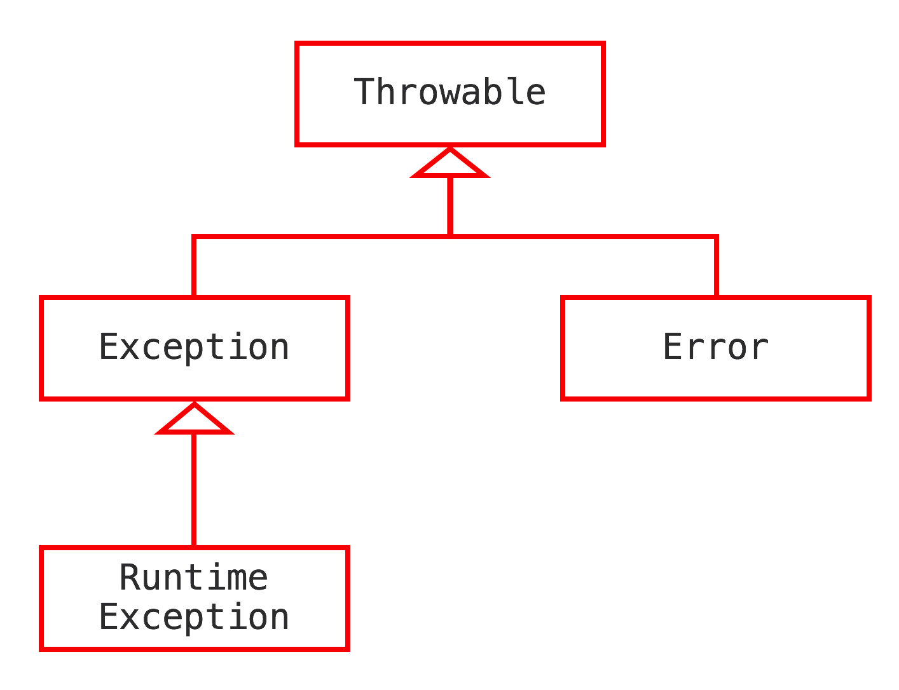

# jvm异常处理

[[toc]]

## 基本概念

&emsp;&emsp;所有异常都是Throwable类或者其子类的实例。Throwable有两大之类:`Error`涵盖程序不应捕获的异常,当程序触发`Error`时，
它的执行状态已经无法恢复，需要中止线程甚至是中止虚拟机。`Exception`涵盖程序可能需要捕获并且处理的异常。具体如下图：

:::tip
Exception 有一个特殊的子类`RuntimeException`,用来表示“程序虽然无法继续执行，但是还能抢救一下”的情况.
:::
&emsp;&emsp;`RuntimeException`和`Error`属于java里的非检查异常（`unchecked exception`），其他异常则属于检查异常（`checked exception`）。
check异常需要程序显式捕获或者在方法声明中用throws关键字标注。通常情况，自定义异常通常为检查异常。

## 异常捕获流程

- try代码块：用来标记需要进行异常监控的代码。
- catch代码块：跟在try代码块之后，用来捕获在try代码块中触发的某种指定类型的异常。
:::tip
&emsp;&emsp;除了声明所捕获异常的类型之外，catch代码块还定义了针对对该异常类型的异常处理器。在java中，try代码块后面可以跟着多个catch代
码块，来捕获不同类型的异常。java虚拟机会从上至下匹配异常处理器。因此，前面的catch代码块所捕获的异常类型不能覆盖后边的，否则编译器会报错。
:::
- finally代码块：跟在try代码块和catch代码块之后，用来声明一段必定运行的代码。它的设计初衷是为了避免跳过某些关键的清理代码，例如关闭已打开的系统资源。

## 原理